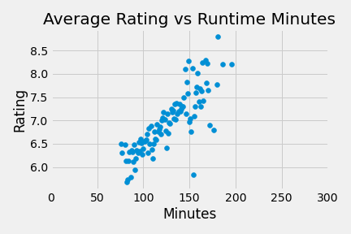

# Microsoft Needs Movie Analysis

**Authors**: Ryan Reilly, Brian Matsiko, Kyle Dufrane

## Overview

This project analyzes movie data from IMDb, The Numbers, and Box Office Mojo websites. The IMDb dataset includes data of over 38,000 movies. The Numbers dataset includes budget and revenue data of over 5,000 movies and the Box Office Mojo dataset includes revenue data of over 3,000 movies. Descriptive analysis of movie data shows that it is important to be slelective about certain attributes of the movie you create.


## Business Problem

Microsoft is looking to develop an internal film department and needs clarity on how to be the most successful in the movie industry. Microsoft has never created a movie before. Choosing the first movie to make in this department is critical to their success in the movie industry. Through our analysis of various sources, we took a look at movies that were released in the last 10 years to get an idea of how recent movies have performed. Given that, we are going to provide recommendations to Microsoft based on the following:
***
* How much money to budget for the movie
* A look at the top competitors
* Which director to choose
* When to release the movie
* How long to make the movie
***

## Data

IMDB is the most popular dataset about movie information. Each row in this dataset represents a unique movie and surrounding information about the movie. The Numbers dataset includes each unique movie along with budget and revenue numbers. The Box Office Mojo dataset includes domestic and forign revenue for each movie but also includes the studio that distributed the move. Below are links to the sites that we pulled our data from:

***
* [IMDB](https://www.imdb.com/interfaces/)
* [The Numbers](https://www.the-numbers.com)
* [Box Office Mojo](https://www.boxofficemojo.com)
***

## Methods

This project utilizes descriptive analysis, including examination of correlation and relationship among the different variables. This provides insight for Microsoft into what characteristics of a movie can lead to higher box office earnings.

***

## Results

***
Consider a larger budget for the movie production. This tends to lead towards higher revenue and profits.


***
Make reference to major competitor work (Walt Disney and Warner Bros studios) who statistically generate the most average and total revenue per movie


***
Consider working with the highest rated Directors.

| Director           | Average Rating|
| -------------      |:-------------:| 
| Christopher Nolan  |8.455479       | 
| Lee Unkrich        |8.349254       | 
| Joe Russo          |8.198621       |
| S.S. Rajamouli     |8.193333       | 
| Asif Kapadia       |8.148718       | 


***
Consider releasing movies at the beginning of May as the three most profitable months are May, June and July


***
Consider making the movie longer rather than shorter



***


## Conclusions

This analysis leads to the following recommendations for creating a movie.
1. **Spend more money to make more money.**
There is a positive corrrelation with how much money is budgeted for a film and how much revenue and profit the film will make. Spending more money on the film usually generates more revenue and profit. If you look at the top 5 most profitable movies released in May since 2010, they had an average budget of around $223 million. These were all movies in one of our highest rated genres, Action,Adventure,Sci-Fi.
2. **Understand your competitors (Walt Disney and Warner Bros) who generate the most revenue per movie.**
These studios have the highest average grossing revenue for those studios who have made over 100 movies. During May, which is the most profitable month of the year, Walt Disney distributed the top 5 highest profitable movies while Warner Brothers distributed top movies by profit in June and July, the 2nd and 3rd highest average profit months respectively.
3. **Engage with the top directors (Christopher Nolan and Joe Russo)**
These top directors have the highest everage rating for movies with more than 30,000 votes in IMDb. Joe Russo and Christopher Nolan directed two of the most profitable films, Captain America: Civil War, and The Dark Knight Rises. They both also direct films in one of the highest rated genres, which is Action,Adventure,Sci-Fi. In addition, they also direct movies for your competitors, Walt Disney and Warner Bros.
4. **Consider releasing during May which is the month that generates the most profit.**
It makes the most sense to release your film during May. May, June and July are the most profitable months of the year. The top 5 most profitable movies in May over the last 10 years were distributed by Walt Disney and profited over $500 million combined.
5. **Consider making your movie longer, rather than shorter.**
The average ratings of movies tend to increase as the length of the movie increases. Our analysis shows the most positive incerease in ratings for movies in the Action, Advneture, Sci-Fi genre up to 200 minute movies.

## Next Steps

Further analyses could provide even more insight into how you will create and distribute Microsoft's first movie:

**Better idea of budgets and profits for movies in each genre.**
We could get an idea of ROI for each movie and by each studio rather than total numbers like we shared in this analysis. Also, if we could find breakdowns of how the budget was spent by each studio to show Microsoft how much they should advertise, how they should advertise,how much to pay their actors/actresses/directors etc. These findings can answer question like: Does it make sense to pay top dollar to top talent?

**Better qualitative analysis on why studios, writers, directors, actors/actresses, would want to work with Microsoft.**
Maybe there are certain things they look for from the company producing the film other than money. This could be done by surveys to individual writers/directors/actors.

**Better idea of studio culture, the benefits of other studios and how they treat there employees and operate the business.**
We could look at what HR benefits the studio offers, compensation, community events. Do they have a "feelings Friday?"


## For More Information

Please review our full analysis in [our Jupyter Notebook](./final_notebook.ipynb) or our [presentation](./final_presentation.pdf).

For any additional questions, please contact **Ryan Reilly ryan.m.reilly@gmail.com, Kyle Dufrane kyle.dufrane@gmail.com, Brian Matsiko matsikobrian@yahoo.com**

## Repository Structure

Describe the structure of your repository and its contents, for example:

```
├── Microsoft_Movie_Analysis_README.md                          
├── final_notebook.ipynb   
├── final_presentation.pdf         
├── data                            
└── images
```
