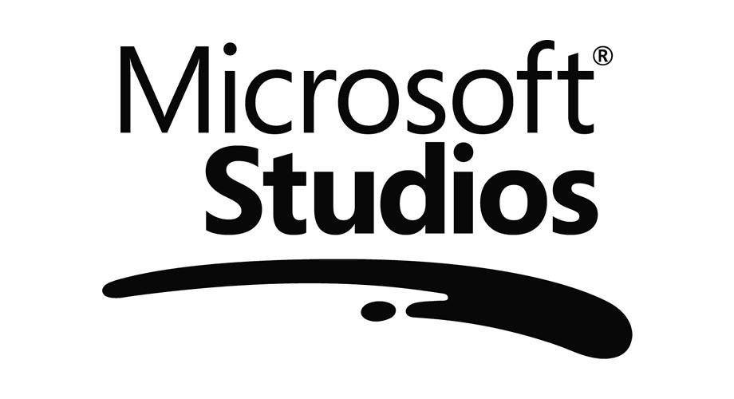
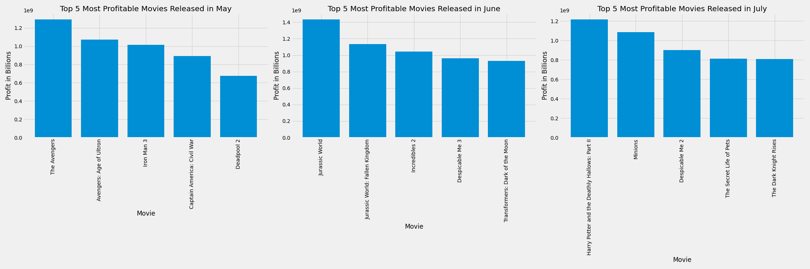
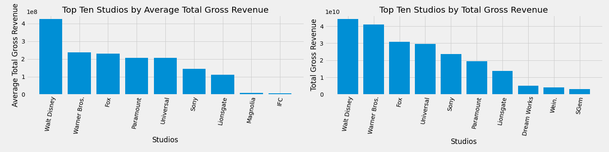

# Microsoft Needs Movie Analysis

**Authors**: Ryan Reilly, Brian Matsiko, Kyle Dufrane

## Overview

This project analyzes movie data from IMDb, The Numbers, and Box Office Mojo websites. The IMDb dataset includes data of over 38,000 movies. The Numbers dataset includes budget and revenue data of over 5,000 movies and the Box Office Mojo dataset includes revenue data of over 3,000 movies. Descriptive analysis of movie data shows that it is important to be slelective about certain attributes of the movie you create.



## Business Problem

Microsoft is looking to develop an internal film department and needs clarity on how to be the most successful in the movie industry. Microsoft has never created a movie before. Choosing the first movie to make in this department is critical to their success in the movie industry. Through our analysis of various sources, we took a look at movies that were released in the last 10 years to get an idea of how recent movies have performed. Given that, we are going to provide recommendations to Microsoft based on the following:
***
* Which studio Microsoft should chose to distribute the movie
* Which director to chose
* When to release the movie
* How much money to budget for the movie
* How long to make the movie
***

## Data

IMDB is the most popular dataset about movie information. Each row in this dataset represents a unique movie and surrounding information about the movie. The Numbers dataset includes each unique movie along with budget and revenue numbers. The Box Office Mojo dataset includes domestic and forign revenue for each movie but also includes the studio that distributed the move. Below are links to the sites that we pulled our data from:

***
* [IMDB](https://www.imdb.com/interfaces/)
* [The Numbers](https://www.the-numbers.com)
* [Box Office Mojo](https://www.boxofficemojo.com)
***

## Methods

This project utilizes descriptive analysis, including examination of correlation and relationship among the different variables. This provides insight for Microsoft into what characteristics of a movie can lead to higher box office earnings.

***

## Results

***
Consider releasing movies at the beginning of May as the three most profitable months are May, June and July


***

Consider a larger budget for the movie production. This tends to lead towards higher revenue and profits.

***

Consider working with Walt Disney and Warner Bros studios who statistically generate the most average and total revenue per movie

***

Consider working with the highest rated Directors.

| Director           | Average Rating|
| -------------      |:-------------:| 
| Christopher Nolan  |8.455479       | 
| Lee Unkrich        |8.349254       | 
| Joe Russo|         |8.198621       |
| S.S. Rajamouli     |8.193333       | 
| Asif Kapadia       |8.148718       | 
| Quentin Tarantino  |8.104110       | 
| Nuri Bilge Ceylan  |8.066667       | 
| Rajkumar Hirani    |8.041176       | 
| Stephen Chbosky    |8.000000       | 
| Neeraj Pandey      |8.000000       | 
***

Consider making the movie around 120 to 140 minutes


***


## Conclusions

This analysis leads to the following recommendations for creating a movie.
1. Engage with the top 3 studios (Walt Disney, Warner Bros, and Fox) who generate the most revenue per movie.
These 3 studios have the highest average grossing revenue for those studios who have made over 100 movies. During May, which is the most profitable month of the year, Walt Disney distributed the top 5 highest profitable movies.
2. Engage with the top 3 directors (Anthony Russo, John Russo, Christopher Nolan)
These top 3 directors have the highest everage rating for movies with more than 5,000 votes in IMDB. They also all specialize in directing movies in one of the top 3 genres by average rating (Adventure/Drama/Sci-Fi). In addtion, two of our recommended directors (Anthony Russo and John Russo) directed one of the top budget films (Captain America: Civil War).
3. Consider releasing during May, June, or July which are months that generate the most profit.
The average total revenue is over $1.2 billion for movies relaesed in these months over the last 10 years. It makes sense to release your film during May with Walt Disney. The top 5 most profitable movies in May over the last 10 years were distriubted by Walt Disney.
4. Spend more money to make more money (scatter of budget to profit and revenue).
There is a positive corrrelation with how much money is budgeted for a film and how much revenue and profit the film will make. Spending more money on the film usually generates more revenue and profit. If you look at the top 5 most profitable movies realesed in May since 2010, they had an average budget of around $223 million. These were all movies in one of our recommended genres (Adventure, Drama, Sci-Fi) and with our top recommended studio, Walt Disney.
5. Consider making your movie around 150 minutes.
The average ratings of movies tend to increase as the length of the movie increases. Our analysis show the most positive incerease in ratings happens to movies up until 150 minutes.


## For More Information

Please review our full analysis in [our Jupyter Notebook](./final_notebook.ipynb)or our [presentation](./DS_Project_Presentation.pdf).

For any additional questions, please contact **Ryan Reilly ryan.m.reilly@gmail.com, Kyle Dufrane kyle.dufrane@gmail.com**, Brian Matsiko matsikobrian@yahoo.com**

## Repository Structure

Describe the structure of your repository and its contents, for example:

```
├── README.md                           <- The top-level README for reviewers of this project
├── dsc-phase1-project-template.ipynb   <- Narrative documentation of analysis in Jupyter notebook
├── DS_Project_Presentation.pdf         <- PDF version of project presentation
├── data                                <- Both sourced externally and generated from code
└── images                              <- Both sourced externally and generated from code
```
